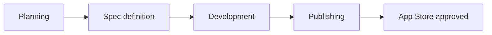

# Mindmemo — Master Project Context

**Purpose:** One document so any agent (Cursor, Claude Code, Copilot, etc.) understands the whole project, how the workspace is organized, and how to continue without re-discovery.

**Live state (always fresh):** [`STATUS.md`](STATUS.md) — phase, last session, next step, blockers.  
**History (append-only):** [`PROJECT_LOG.md`](PROJECT_LOG.md) — decisions and work from day one.

---

## New agent — start here

### 1. Read in this order (mandatory)

| Step | File | What you learn |
|------|------|----------------|
| 1 | **This file** (`CONTEXT.md`) | Workspace map, workflow, rules, file index |
| 2 | [`STATUS.md`](STATUS.md) | What to do **right now** |
| 3 | [`PROJECT_LOG.md`](PROJECT_LOG.md) | What happened before (newest first) |
| 4 | [`CLAUDE.md`](CLAUDE.md) | Routing table, naming, package stack |
| 5 | [`standards/CONTEXT.md`](standards/CONTEXT.md) | App-specific non-negotiables |
| 6 | [`planning/docs/project-origin.md`](planning/docs/project-origin.md) | Frozen discovery snapshot (scope) |

Then open the **workspace** you are working in (see [Four workspaces](#four-workspaces)) and read that folder’s `CONTEXT.md`.

### 2. Task-specific extras

| You are… | Also read |
|----------|-----------|
| Planning PRD / architecture | [`planning/CONTEXT.md`](planning/CONTEXT.md), [`planning/docs/`](planning/docs/) |
| Writing a feature spec | [`spec-definition/CONTEXT.md`](spec-definition/CONTEXT.md), active `spec-definition/features/[name]/` |
| Implementing Flutter | [`development/CONTEXT.md`](development/CONTEXT.md), [`../../flutter-standards/CONTEXT.md`](../../flutter-standards/CONTEXT.md), [`development/packages/ALLOWED_PACKAGES.md`](development/packages/ALLOWED_PACKAGES.md), feature spec trilogy |
| Preparing App Store | [`publishing/CONTEXT.md`](publishing/CONTEXT.md) |

### 3. Continue from here

After reading the table above:

1. Open **`STATUS.md`** → do **“What is next”** unless the user gave a different task.
2. Respect **blockers**; do not work around them without updating the log.
3. If the user’s request conflicts with `project-origin.md` or standards, **stop** and propose an ADR + `PROJECT_LOG.md` entry—do not silently change scope.

**Conflict rule:** `STATUS.md` wins for “what to do next.” If `PROJECT_LOG.md` disagrees, fix the log.

---

## What we are building

**Mindmemo** — privacy-first Flutter app (**iOS first**) for creators:

1. Record voice memos on-device  
2. Transcribe to text (on-device STT)  
3. Tag and store locally  
4. Optional: local LLM analysis (lazy-loaded, user-triggered)  
5. Iterative chat **per memo** to refine ideas  
6. Convert content (e.g. short script, blog post)

**v1 complete when:** App Store submission is **approved** with MVP from the PRD.

**Out of scope unless PRD adds it:** cloud inference, Android/desktop polish, cross-memo chat.

Full discovery: [`planning/docs/project-origin.md`](planning/docs/project-origin.md).

---

## Repository map

```
HU/                                    # monorepo root
├── flutter-standards/                 # shared Flutter conventions (all apps)
│   └── CONTEXT.md
└── projects/mindmemo/                 # THIS PROJECT — you are here
    ├── CONTEXT.md                     # ← master context (this file)
    ├── AGENTS.md                      # short bootstrap checklist
    ├── STATUS.md                      # ← live: phase, next step, blockers
    ├── PROJECT_LOG.md                 # ← history: append every session
    ├── CLAUDE.md                      # routing + global rules + naming
    │
    ├── standards/CONTEXT.md           # mindmemo-only rules
    ├── planning/                      # PRD, ADRs, risks — before code
    │   ├── CONTEXT.md
    │   ├── docs/
    │   │   ├── project-origin.md      # frozen discovery
    │   │   ├── package-research.md
    │   │   └── (prd.md, core-loop.md, adr/ — planned)
    │   └── risks/register.md
    │
    ├── spec-definition/               # per-feature specs — before impl
    │   ├── CONTEXT.md
    │   └── features/[feature_name]/
    │       ├── requirements.md
    │       ├── design.md
    │       └── tasks.md
    │
    ├── development/                   # implementation
    │   ├── CONTEXT.md
    │   ├── packages/ALLOWED_PACKAGES.md
    │   ├── logs/implementation-log.md
    │   └── (app/ — Flutter root, created at dev handoff)
    │
    └── publishing/                    # App Store, listing, assets
        ├── CONTEXT.md
        ├── checklist/app-store.md
        └── store-assets/
```

**Slug:** `mindmemo` (display name TBD). **Shared standards:** `../../flutter-standards/`.

---

## Four workspaces

Work moves **forward** through phases. Do not skip ahead without updating `STATUS.md`.



| Workspace | Folder | Phase gate | Primary outputs |
|-----------|--------|------------|-----------------|
| **Planning** | `planning/` | Discovery done | PRD, core loop, ADRs, data model, risk register |
| **Spec definition** | `spec-definition/` | PRD + arch reviewed | `requirements.md`, `design.md`, `tasks.md` per feature |
| **Development** | `development/` | Feature spec trilogy complete | Flutter code in `app/`, tests, implementation log |
| **Publishing** | `publishing/` | MVP feature-complete | Checklist, listing, screenshots brief, submission |

**Current phase:** see [`STATUS.md`](STATUS.md) (as of bootstrap: **Planning**, no Flutter `app/` yet).

---

## Context layers (how memory works across agents)

| Layer | Source | Updated when |
|-------|--------|--------------|
| **Now** | `STATUS.md` | Every session end |
| **History** | `PROJECT_LOG.md` | Every session end (append) |
| **Why / scope** | `planning/docs/project-origin.md`, PRD, ADRs | Explicit PRD/ADR change only |
| **How to work** | This file, `CLAUDE.md`, workspace `CONTEXT.md` | Process changes |
| **App rules** | `standards/CONTEXT.md`, `flutter-standards/` | New cross-cutting rule |
| **What was built** | `development/logs/implementation-log.md`, `app/` code | During development |

Agents do **not** rely on chat history—rely on these files.

---

## Non-negotiables (summary)

Details: [`standards/CONTEXT.md`](standards/CONTEXT.md) + [`flutter-standards/CONTEXT.md`](../../flutter-standards/CONTEXT.md).

1. **On-device only** — no remote APIs for STT, LLM, or user content.  
2. **Lazy LLM** — no analysis model at app launch; load on first user analysis.  
3. **Clean Architecture** — `lib/features/[name]/{data,domain,presentation}`.  
4. **BloC + GoRouter + get_it** — per flutter-standards.  
5. **Specs before code** — no `development/` work without spec trilogy.  
6. **Package allowlist** — [`development/packages/ALLOWED_PACKAGES.md`](development/packages/ALLOWED_PACKAGES.md).  
7. **Tagged local storage** — stable memo IDs; **tostore** direction.  
8. **Per-memo chat** — unless a spec explicitly says otherwise.

---

## Tech stack (target)

| Concern | Direction |
|---------|-----------|
| STT + LLM | **runanywhere** (ONNX); Whisper fallback if iOS STT gaps |
| Storage | **tostore** |
| Audio | `record` |
| State / routes / DI | `flutter_bloc`, `go_router`, `get_it` |
| Export (post-MVP / PRD) | `pdf`, `share_plus`, `markdown`, etc. |

Versions and allowlist: [`development/packages/ALLOWED_PACKAGES.md`](development/packages/ALLOWED_PACKAGES.md).

---

## End of every session (required)

Before stopping, hand off to the **next** agent:

1. **`STATUS.md`** — phase, what you completed, **exact next step**, blockers, date.  
2. **`PROJECT_LOG.md`** — append entry: what happened, decisions, deferred, “next agent should”.  
3. **`development/logs/implementation-log.md`** — if you wrote code (files touched, done vs deferred).  
4. **This file or `CLAUDE.md`** — one-line “Recent changes” only if process/routing changed.

---

## File index (quick lookup)

| Need | Path |
|------|------|
| Continue work | `STATUS.md` |
| Past sessions | `PROJECT_LOG.md` |
| Short bootstrap | `AGENTS.md` |
| Route by task | `CLAUDE.md` |
| Discovery snapshot | `planning/docs/project-origin.md` |
| Package research | `planning/docs/package-research.md` |
| Risks | `planning/risks/register.md` |
| Allowed dependencies | `development/packages/ALLOWED_PACKAGES.md` |
| Impl session log | `development/logs/implementation-log.md` |
| App Store checklist | `publishing/checklist/app-store.md` |
| Store copy | `publishing/store-assets/listing.md` |
| Screenshot brief | `publishing/store-assets/screenshots-brief.md` |
| Flutter conventions | `../../flutter-standards/CONTEXT.md` |
| Cursor auto-load rule | `../../.cursor/rules/mindmemo-bootstrap.mdc` |

---

**Last updated:** 2026-05-19  
**Recent changes:** Created master `CONTEXT.md` for cross-agent continuity; links all workspaces and session handoff protocol.
